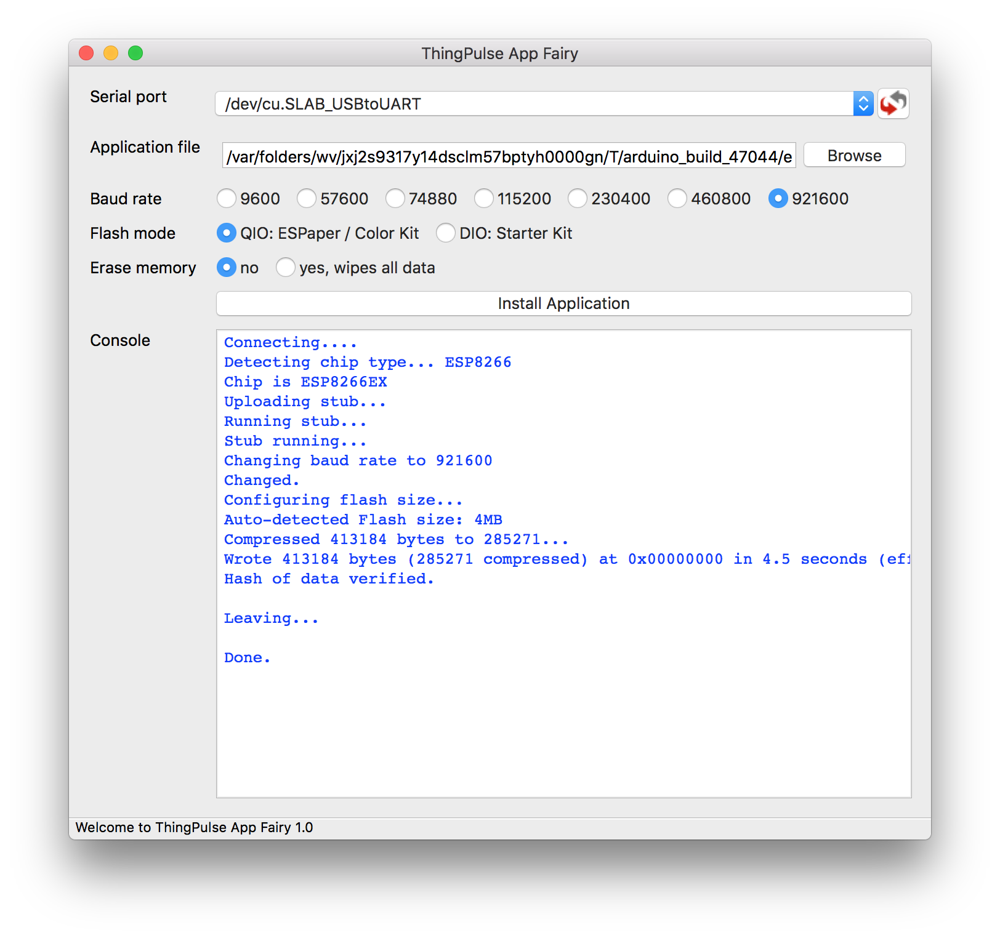

# ThingPulse App Fairy
[](https://github.com/marcelstoer/nodemcu-pyflasher/blob/master/LICENSE)
[](https://twitter.com/intent/tweet?text=Wow:&url=https%3A%2F%2Fgithub.com%2Fthingpulse%2Fapp-fairy)
[](https://www.facebook.com/sharer/sharer.php?u=https%3A%2F%2Fgithub.com%2Fthingpulse%2Fapp-fairy)

Self-contained installer based on [NodeMCU PyFlasher](https://github.com/marcelstoer/nodemcu-pyflasher) for ThingPulse applications



## Installation
ThingPulse App Fairy does not have to be installed, just double-click it and it'll start. Check the [releases section]
(https://github.com/thingpulse/app-fairy/releases) for downloads for your platform. For every release we provide a .exe 
file for Windows and a .dmg for macOS.

## Status
Scan the [list of open issues](https://github.com/thingpulse/app-fairy/issues) for bugs and pending features.

## Getting help
In the unlikely event that you're stuck with this simple tool the best way to get help is to turn to the [ThingPulse 
support forum](https://support.thingpulse.com).

## Build it yourself
If you want to build this application yourself you need to:

- Install [Python 3.x](https://www.python.org/downloads/) and [Pip](https://pip.pypa.io/en/stable/installing/) (it comes with Python if installed from `python.org`).
- Create a virtual environment with `python -m venv venv`
- Activate the virtual environment with `. venv/bin/activate` (`. venv/Scripts/activate` if you are on Windows with [Cygwin](https://www.cygwin.com/) or [Mingw](http://mingw.org/))
- Run `pip install -r requirements.txt`

**A note on Linux:** As described on the [downloads section of `wxPython`](https://www.wxpython.org/pages/downloads/), wheels for Linux are complicated and may require you to run something like this to install `wxPython` correctly:

```bash
# Assuming you are running it on Ubuntu 18.04 LTS with GTK3
pip install -U \
    -f https://extras.wxpython.org/wxPython4/extras/linux/gtk3/ubuntu-18.04 \
    wxPython
```

## License
[MIT](http://opensource.org/licenses/MIT) © Marcel Stör (a ThingPulse co-founder)
